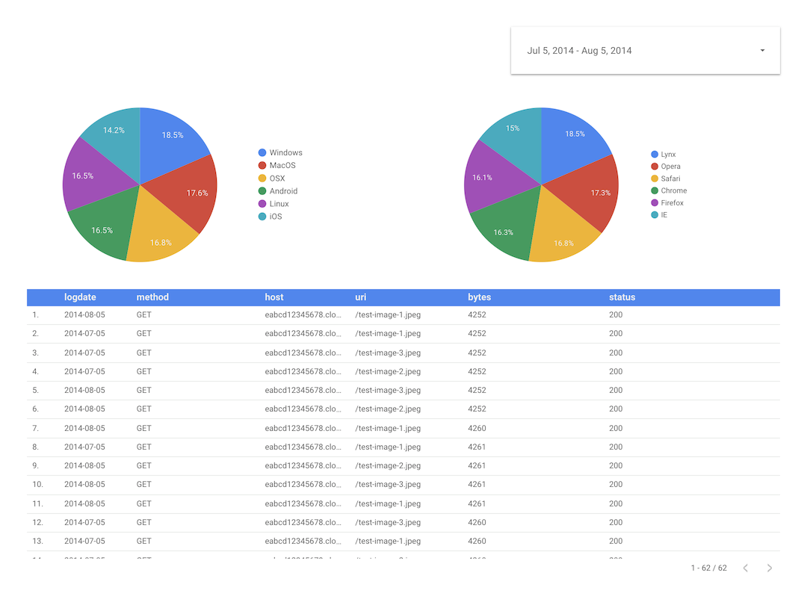

# AWS Athena Connector for Data Studio

*This is not an official Google product*

This [Data Studio] [Community Connector] lets you query data directly from AWS S3 Buckets.

The connector uses [AWS Athena] for underlying
queries.



## Set up the Community Connector for personal use

To use this Community Connector in Data Studio there is a one-time setup to
deploy your own personal instance of the connector using Apps Script.

### Deploy the connector
Follow the [deployment guide] to deploy the Community Connector.

## Using the connector in Data Studio

Once you've set up and deployed the connector, follow the
[Use a Community Connector] guide to use the connector in Data Studio.

**Note**: After using the connector in Data Studio, as long as you do not
[revoke access], it will remain listed in the [connector list] for easy access
when [creating a new data source].

### Usage example with sample data

The following steps walk through an example of using the connector to query
sample data. **Note**: This example uses sample data located in the `us-west-2`
region.

#### 1. Create IAM User

Create an [IAM User] with **programmatic access**.

Attach managed policies `AmazonAthenaFullAccess` and `AmazonS3ReadOnlyAccess`
to this user.

Note the user's access key and secret; you'll need it later.

#### 2. Create Athena Table

Visit the [Athena Console] and create a sample table using the following
statement:

```
CREATE EXTERNAL TABLE IF NOT EXISTS cloudfront_logs (
  LogDate DATE,
  Time STRING,
  Location STRING,
  Bytes INT,
  RequestIP STRING,
  Method STRING,
  Host STRING,
  Uri STRING,
  Status INT,
  Referrer STRING,
  os STRING,
  Browser STRING,
  BrowserVersion STRING
  ) ROW FORMAT SERDE 'org.apache.hadoop.hive.serde2.RegexSerDe'
  WITH SERDEPROPERTIES (
  "input.regex" = "^(?!#)([^ ]+)\\s+([^ ]+)\\s+([^ ]+)\\s+([^ ]+)\\s+([^ ]+)\\s+([^ ]+)\\s+([^ ]+)\\s+([^ ]+)\\s+([^ ]+)\\s+([^ ]+)\\s+[^\(]+[\(]([^\;]+).*\%20([^\/]+)[\/](.*)$"
  ) LOCATION 's3://athena-examples-us-west-2/cloudfront/plaintext/';
```

You can try `SELECT * FROM "default"."cloudfront_logs" limit 10;` to preview
the table.

### 3. Create a data source using the connector

Use the connector to create a new data source in Data Studio. Configure the
connector as follows:

Key                      | Value
------------------------ | -----
`AWS_ACCESS_KEY_ID`      | {KEY} - From step #1.
`AWS_SECRET_ACCESS_KEY`  | {SECRET} - From Step #1.
`AWS Region`             | {AWS_REGION}
`Glue Database Name`     | `default`
`Glue Table Name`        | `cloudfront_logs`
`Query Output Location`  | `s3://aws-athena-query-results-{account_id}-us-west-2/data-studio`
`Date Range Column Name` | `LogDate`

For `Query Output Location`, AWS should have created an S3 bucket to store the
query results, you can find the bucket name in the S3 console. If not, create
an S3 bucket that starts with the name `aws-athena-query-results-`.

Click **CONNECT** and then create a report to query the sample data. Note that
the date range for the sample is from `2014-07-05` to `2014-08-05`.

## Troubleshooting

### This app isn't verified

When authorizing the community connector, if you are presented with an
"unverified" warning screen see [This app isn't verified] for details on how to
proceed.

[Data Studio]: https://datastudio.google.com
[Community Connector]: https://developers.google.com/datastudio/connector
[AWS Athena]: https://aws.amazon.com/athena/
[deployment guide]: ../deploy.md
[Use a Community Connector]: https://developers.google.com/datastudio/connector/use
[revoke access]: https://support.google.com/datastudio/answer/9053467
[connector list]: https://datastudio.google.com/c/datasources/create
[creating a new data source]: https://support.google.com/datastudio/answer/6300774
[IAM User]: https://console.aws.amazon.com/iam/home
[Athena Console]: https://us-west-2.console.aws.amazon.com/athena/home
[This app isn't verified]: ../verification.md